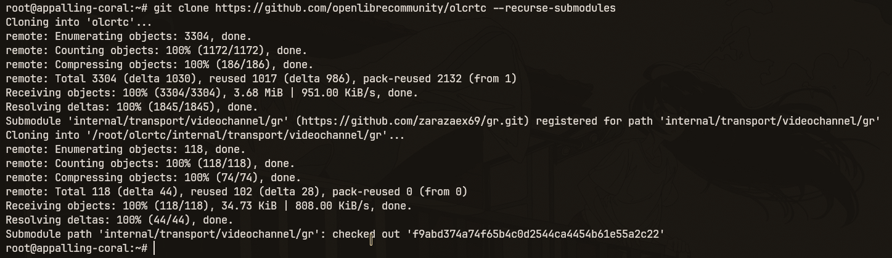

<div align="center">


</div>


# Быстрый старт (через скрипты)

> **Важно:** Обязательно проверяйте, есть ли сервис видеозвонков у вас в белых списках. Если его там нет - используйте другой. Список всех сервисов в белых списках скоро будет опубликован.


Этот способ самый простой. Все запускается в контейнере [Podman](https://ru.wikipedia.org/wiki/Podman).
Скрипт всё сделает сам: скачает [исходники](https://github.com/fedorokss/olcrtc-clone), соберёт в контейнере, запустит.

Проект в бете. По проблемам: t.me/openlibrecommunity

---

## Что нужно установить

### git

```sh
apt install git    # Debian   / Ubuntu   / Mint
pacman -S git      # Arch    / CacheOS / Manjaro
dnf install git    # Fedora / RHEL / CentOS
```

### podman

```sh
apt install podman   # Debian   / Ubuntu   / Mint
pacman -S podman     # Arch    / CacheOS / Manjaro
dnf install podman   # Fedora / RHEL    / CentOS
```

### curl

```sh
apt install curl      # Debian   / Ubuntu  / Mint
pacman -S curl        # Arch    / CacheOS / Manjaro
dnf install curl      # Fedora / RHEL    / CentOS
```

### swap (РћР—РЈ)

Если у вас меньше 4ГБ оперативной памяти, сборка может вылетать. **Обязательно включите SWAP**:

```bash
sudo fallocate -l 4G /swapfile && sudo chmod 600 /swapfile && sudo mkswap /swapfile && sudo swapon /swapfile
```

---

## Шаг 1: Скачать репозиторий

```sh
git clone https://github.com/fedorokss/olcrtc-clone --recurse-submodules
cd olcrtc
```




---

## Шаг 2: Запустить сервер

На машине, через которую должен идти трафик (VPS, сервер за рубежом, домашний ПК):

```sh
./script/srv.sh
```

#### Флаги `srv.sh`

| Флаг | Что делает |
|---|---|
| `--branch=<name>` | Использовать другую ветку репозитория вместо `main` |
| `--no-cache` | Очистить Go-кеш (`~/.cache/olcrtc`) перед сборкой - пересобрать с нуля |

`--no-cache` полезен когда нужно убедиться что собирается актуальный код (например после обновления зависимостей или при странных ошибках сборки). Без флага скрипт переиспользует кеш `gomod` и `gobuild`, что сильно ускоряет повторные запуски.

```sh
./script/srv.sh --no-cache              # сборка с нуля
./script/srv.sh --branch=dev --no-cache # ветка dev, без кеша
```

### Auth (на каком сервисе передавать трафик)

```
Выберите auth-провайдера:
  1) jitsi
  2) telemost
  3) wbstream
Введите номер [1-3, по умолчанию: 1]:
```

Выбери сервис. Полную матрицу совместимости смотри в [settings.md](settings.md).

**По умолчанию `jitsi`** - стабильно работает на datachannel против self-hosted и публичных Jitsi инстансов (например `meet1.arbitr.ru` или `meet.cryptopro.ru`). Проверьте в браузере, какой из них доступен в вашей сети.

### Transport (как именно передавать данные)

```
Выберите транспорт:
  1) datachannel
  2) videochannel
  3) seichannel
  4) vp8channel
Введите номер [1-4, по умолчанию: 1]:
```

Рекомендации:
- **datachannel** - самый быстрый, минимальный пинг. Стабильно работает с `jitsi` через colibri-ws bridge channel. **WBStream DC не работает** в обычном guest flow (токены без `canPublishData`). **Telemost удалил DC**.
- **vp8channel** - работает с telemost и wbstream, быстрый, но большой пинг.
- **seichannel** - работает только с wbstream, медленный, но мелкий пинг.
- **videochannel** - работает с wbstream стабильно, с telemost по возможности; самый медленный и с большим пингом.

**Рекомендуемая комбинация: `jitsi + datachannel`** - работает стабильно, не требует регистрации, легко поднимать на своём сервере. Альтернатива: `wbstream + vp8channel`.

### Room ID

```
Введите Room ID:
```

Для **jitsi** - полный URL комнаты в формате `https://host/room` (например `https://meet1.arbitr.ru/myroom` или `https://meet.cryptopro.ru/myroom`). Имя комнаты придумывается на лету, без регистрации. Подойдёт любой публичный или self-hosted Jitsi Meet. **Обязательно проверьте, какой сервер работает в вашей сети** - откройте оба в браузере и используйте тот, который открывается.

Для **telemost** и **wbstream** - создай руму через сайт ([telemost](https://telemost.yandex.ru/), [wbstream](https://stream.wb.ru)) и вставь её ID.

### DNS

```
DNS-сервер [по умолчанию: 8.8.8.8:53]:
```

Нажми Enter. Менять не нужно если нет причин, на всякий можно поставить 77.88.8.8 или DNS твоего провайдера.

### SOCKS5 прокси для исходящего трафика

```
Использовать SOCKS5-прокси для исходящего трафика? (y/N):
```

Если нет - просто Enter, если надо то введи `y`. Нужно чтобы сервер сам ходил через прокси.

### Параметры транспорта (только для videochannel)

```
Видео-кодек:
  1) qrcode
  2) tile (требует 1080x1080)
Введите номер [1-2, по умолчанию: 1]:
```

Выбери кодек:
- **qrcode** - QR-коды, настраиваемое разрешение, стабильный, медленный.
- **tile** - тайловый кодек, только 1080x1080, поддерживает Reed-Solomon коррекцию, не стабилен, более быстрый.

#### qrcode

```
Ширина видео [по умолчанию: 1920]:
Высота видео [по умолчанию: 1080]:
Коррекция ошибок QR (low/medium/high/highest) [по умолчанию: low]:
Размер QR-фрагмента в байтах [по умолчанию: 0 (авто)]:
```

- **Ширина / высота видео** - разрешение видео. Больше = больше данных за кадр, но тяжелее поток.
- **Коррекция ошибок QR** - `low` быстрее, `highest` надёжнее при плохом канале.
- **Размер QR-фрагмента** - размер фрагмента в байтах. `0` = автоматически.

#### tile

```
[*] Выбран tile-кодек, принудительно выставляю 1080x1080
Размер tile-модуля в пикселях 1..270 [по умолчанию: 4]:
Процент Reed-Solomon parity для tile 0..200 [по умолчанию: 20]:
```

- **Размер tile-модуля** - размер одного тайла в пикселях. Меньше = больше данных за кадр.
- **Tile Reed-Solomon parity** - процент избыточности. `0` = без коррекции, `20` оптимально.

#### Общие параметры (для обоих кодеков)

```
FPS видео [по умолчанию: 30]:
Битрейт видео [по умолчанию: 2M]:
Аппаратное ускорение (none/nvenc) [по умолчанию: none]:
```

- **FPS видео** - кадров в секунду. Больше FPS = выше пропускная способность, больше нагрузка на CPU.
- **Битрейт видео** - битрейт ffmpeg. Примеры: `2M`, `5M`, `500K`.
- **Аппаратное ускорение** - `none` если нет GPU, `nvenc` для NVIDIA GPU.

---

### Параметры транспорта (только для vp8channel)

```
VP8 FPS [по умолчанию: 60]:
VP8 batch size (кадров за тик) [по умолчанию: 64]:
```

Нажми Enter, если устраивают значения по умолчанию `60` и `64`.

### Параметры транспорта (только для seichannel)

```
SEI FPS [по умолчанию: 60]:
SEI batch size (кадров за тик) [по умолчанию: 64]:
Размер SEI-фрагмента в байтах [по умолчанию: 900]:
SEI ACK timeout в миллисекундах [по умолчанию: 2000]:
```

Нажми Enter для всех - значения по умолчанию оптимальны.


### Результат

После запуска скрипт выведет:

```
[+] Сервер успешно запущен!

Имя контейнера:  olcrtc-server
Auth:            wbstream
Transport:       datachannel
Room ID:         abc123xyz
Ключ шифрования: d823fa01cb3e0609b67322f7cf984c4ee2e294936fc24ef38c9e59f4799
```

**Сохрани Room ID и ключ шифрования** - они нужны для клиента.

---

## Шаг 3: Запустить клиент

На своей машине (домашний ПК, ноутбук):

```sh
git clone https://github.com/fedorokss/olcrtc-clone --recurse-submodules
cd olcrtc
./script/cnc.sh
```

Отвечай на те же вопросы что на сервере - **auth, transport и room ID должны совпадать**.

Когда спросит ключ:

```
Введите ключ шифрования (hex):
```

Вставь ключ с сервера.

### SOCKS5 адрес и порт

```
SOCKS5 IP [по умолчанию: 127.0.0.1]:
SOCKS5 порт [по умолчанию: 8808]:
```

Нажми Enter оба раза. Прокси поднимется на `127.0.0.1:8808`.

### SOCKS5 аутентификация (необязательно)

```
SOCKS5 логин (оставь пустым, чтобы отключить auth):
```

Если нужна защита логином и паролем - введи логин, затем пароль. Если нет - просто Enter, аутентификация будет отключена.

### Результат

```
[+] Клиент успешно запущен!

Имя контейнера: olcrtc-client
SOCKS5 proxy:   127.0.0.1:8808
```

---

## Шаг 4: Проверить

```sh
curl --socks5-hostname 127.0.0.1:8808 https://icanhazip.com
```

Должен вернуть IP твоего сервера.

Или выставить переменную окружения чтобы всё шло через прокси:

```sh
export all_proxy=socks5h://127.0.0.1:8808
curl https://icanhazip.com
```

---

## Управление

### Логи

```sh
podman logs -f olcrtc-server   # на сервере
podman logs -f olcrtc-client   # на клиенте
```

### Остановить

```sh
podman stop olcrtc-server
podman stop olcrtc-client
```

### Перезапустить (просто запусти скрипт снова)

Скрипт сам останавливает старый контейнер перед стартом нового.

---

## Несколько инстансов на одном сервере

Можно запустить несколько серверов olcrtc на одной машине с разными конфигами (разные провайдеры, комнаты, транспорты). Просто запусти `srv.sh` повторно - каждый запуск создаёт контейнер с уникальным именем (`olcrtc-server-<random>`), они не конфликтуют между собой.

```sh
./script/srv.sh   # первый инстанс - например jitsi + datachannel
./script/srv.sh   # второй инстанс - например wbstream + vp8channel
./script/srv.sh   # третий - другая комната, другой провайдер, и т.д.
```

Каждый запуск спросит свои параметры (auth, transport, room ID) и выдаст свой ключ шифрования. На клиенте для каждого инстанса запускай отдельный `cnc.sh` с **разными SOCKS5 портами** - чтобы переключаться между ними в olcbox.

```sh
./script/cnc.sh   # первый клиент - порт 8808 (по умолчанию)
./script/cnc.sh   # второй клиент - укажи порт 8809
./script/cnc.sh   # третий - порт 8810, и т.д.
```

Посмотреть все запущенные инстансы:

```sh
podman ps --filter name=olcrtc
```

---

Хочешь собрать руками без Podman? -> [Мануальная сборка](manual.md)

Все настройки и матрица совместимости -> [settings.md](settings.md)
